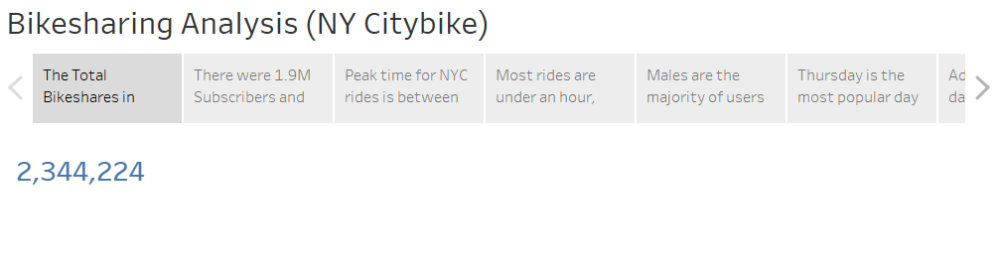
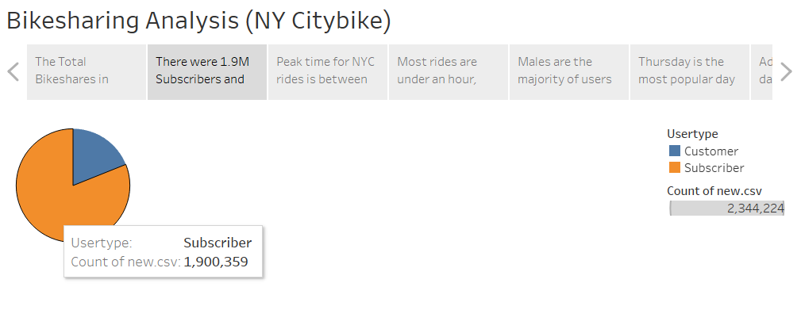
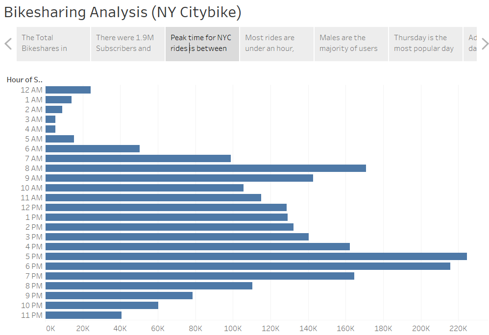
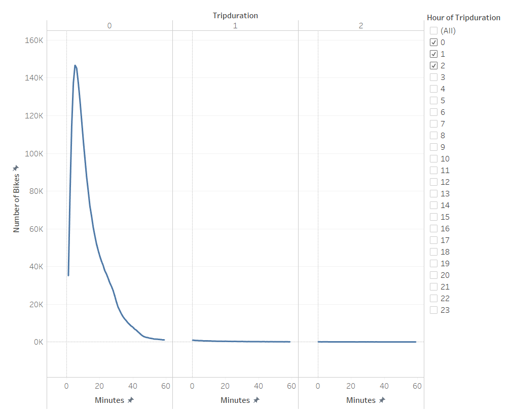
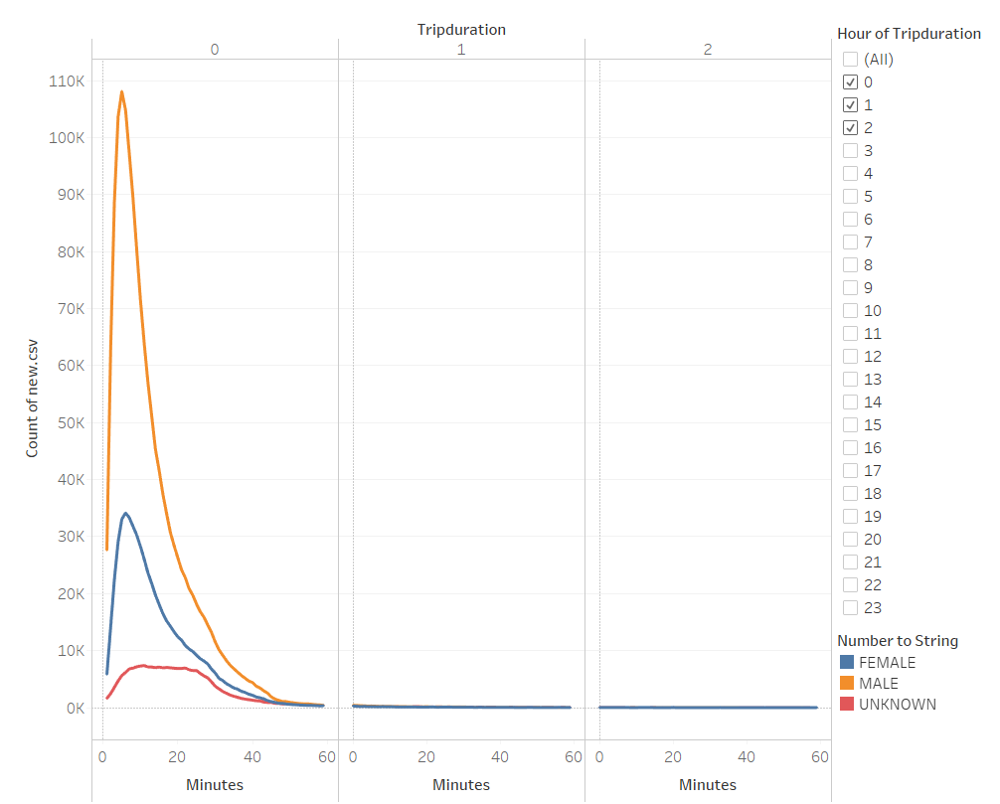
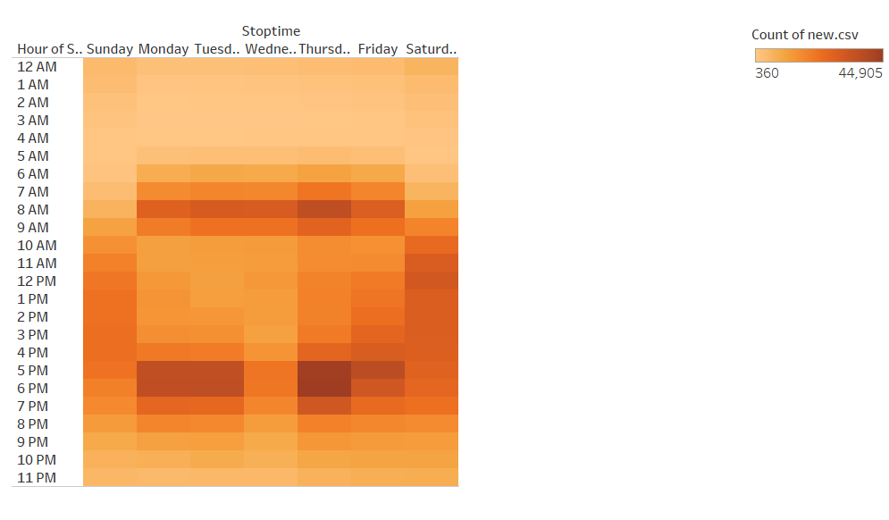
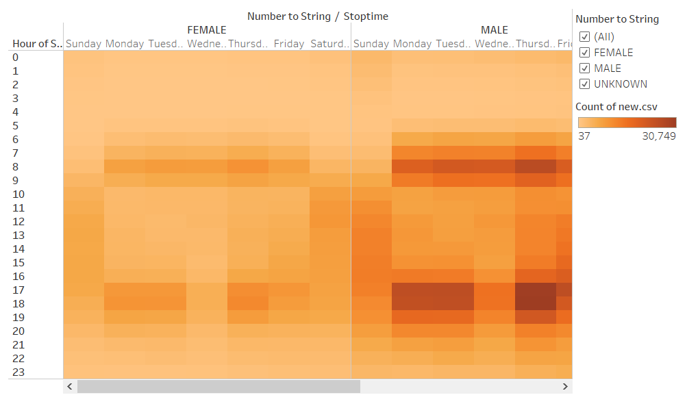
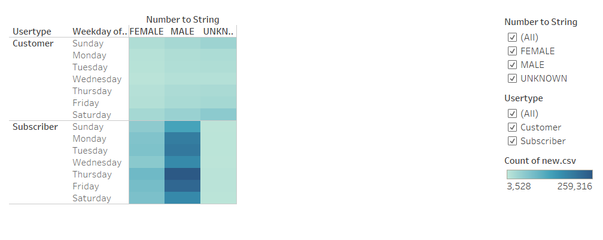

# Bikesharing
## Overview of the statistical analysis:
This project is designed to provide an analysis and feasibility study for a bike sharing program in Des Moines. 

The purpose of this project is provide an analysis and feasibility study for a bike sharing program in Des Moines. Since a program already exists in New York City, their data was evaluated for this analysis.

In this way, one fundamental factor includes the analysis of the tripduration. Finding out how long the trips are in the month of August will provide a good analysis on when the bikes are rented, how long they are rented and what times are the most popular times to rent a bike. The first step included a change made in the csv to change the column that records the trip duration in seconds to hours, minutes and seconds and upload in Tableau the new CSV for the respective analysis. 

## Results:

Using tableau I created 7 different visulizations using the total number of trips, the types of users and the trip duration. Here's what we found:

There was a total of 2,344,224 trips in the month of August.

From the total trips 1,900,359 users subscribe to the company and 443,865 users are customers.

There is a peak number of users who rent their bike for 5-6 hour trips.

Most rides are under an hour with the majority being 5 minutes.

The largest number of individuals happen to be male, the women users dont have as large of a peak and unkown users do not have a peak for tripduration.

Thursday is the most popular day to use the bikeshare program, especially between 5:00PM and 7:00PM. 

Additionally  the data confirms males use the bikeshare program the most. In addition, evenings from 5:00 - 7:00 and mornings from 8:00 - 9:00 are busy.

Suscribers use this service more than Customers. Male subscribers are the heaviest users.

To see all of my visualizations please click the link below:

[link to dashboard](https://public.tableau.com/views/Bikesharing_Analysis_16401184757800/BikesharingAnalysisNYC?:language=en-US&publish=yes&:display_count=n&:origin=viz_share_link)

## Summary:

In summary, the NY Citibike is a popular project where different facts could be obtained after the used of a tool as Tableau . For example, Thursday is the most popular day to take a bike ride using the NY Citibike service. It looks positive consider the times 5:00 - 7:00 and mornings from 8:00 - 9:00 as the busiest to promote the use of the project in the city of Des Moine.

Additionally, with total trips 1,900,359 users subscribe, looks an opportunitty to replicate the subscritpion service in the new project, even considering the majority of trips less than 5 minutes based on the data obtained during August 2018. 

In conclusion, the information that Tableau provide from the data is useful as visualization to analysis the steps for approval of the projects and explanation with possible investors. 

For this, it is possible affirm that there is enough evidence to developed the project in Des Moine a further analysis based on Cost and Benefits of the project. One variable to developed as visualization in a future analysis is the cost of maintenance required for the bikes based on the number of rides and distance completed. This is fundamental, considering the season at Des Moine. 

A suggestion includes that it is possible developing a visualization that involves BikeID and the distance calculated based on Start and End point (considering Longitud and Latituted). In this way, could be projected the tentative maintenance of the equipments (bikes) using a manufacturing recomendation.

Another visualization proposal includes the generation of a graph between the Birth Year and Total Count of Rides by year, being the first step for a tentative campaing of sales, comparing this with the type of poblation at Des Moine to identify the public target for promotions and ads.
